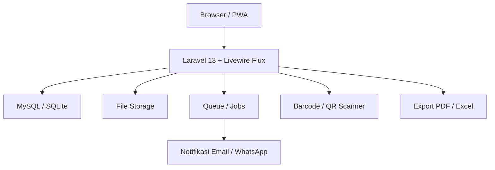
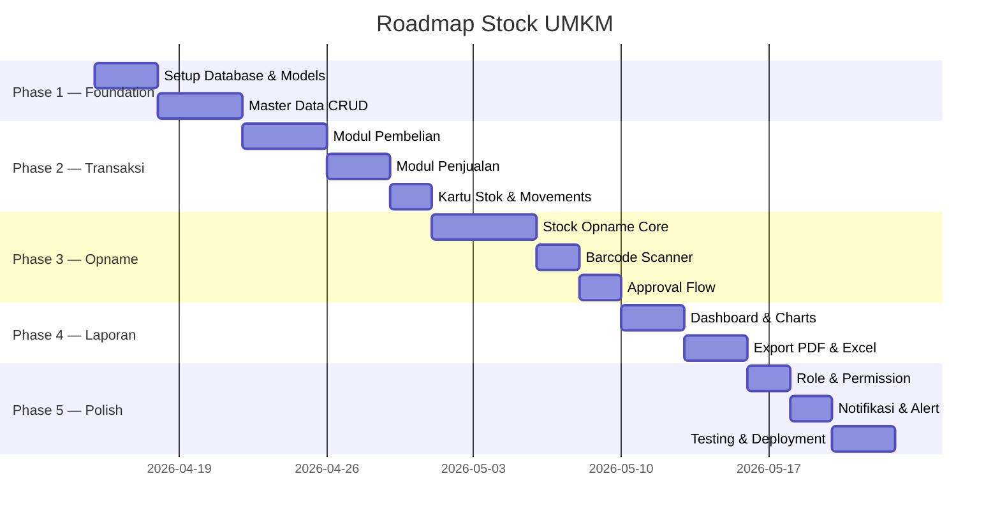

# 📦 Blueprint — Sistem Stock Opname UMKM
### Laravel 13 · Livewire 4 (Flux) · SQLite/MySQL · XAMPP

---

## 🎯 Ringkasan Sistem

Sistem manajemen stok profesional untuk UMKM yang menangani siklus penuh inventaris:
**Pembelian → Penerimaan → Penyimpanan → Penjualan → Opname → Laporan**

---

## 🏗️ Arsitektur Sistem



---

## 📁 Struktur Direktori (Laravel)

```
stock/
├── app/
│   ├── Actions/
│   │   ├── Stock/
│   │   │   ├── CreateStockOpname.php
│   │   │   ├── RecordStockMovement.php
│   │   │   └── AdjustStock.php
│   │   └── Purchase/
│   │       └── ReceiveGoodsAction.php
│   │
│   ├── Http/
│   │   └── Controllers/
│   │       └── ReportController.php       ← Export PDF/Excel
│   │
│   ├── Livewire/                          ← Semua UI komponen
│   │   ├── Dashboard/
│   │   │   └── StockDashboard.php
│   │   ├── Products/
│   │   │   ├── ProductIndex.php
│   │   │   ├── ProductForm.php
│   │   │   └── ProductDetail.php
│   │   ├── Categories/
│   │   │   └── CategoryManager.php
│   │   ├── Suppliers/
│   │   │   └── SupplierManager.php
│   │   ├── Purchases/
│   │   │   ├── PurchaseOrderIndex.php
│   │   │   ├── PurchaseOrderForm.php
│   │   │   └── ReceiveGoods.php
│   │   ├── Sales/
│   │   │   ├── SaleIndex.php
│   │   │   └── SaleForm.php
│   │   ├── StockOpname/
│   │   │   ├── OpnameIndex.php
│   │   │   ├── OpnameSession.php          ← Proses hitung fisik
│   │   │   └── OpnameReport.php
│   │   ├── StockMovements/
│   │   │   └── MovementLog.php
│   │   ├── Reports/
│   │   │   ├── StockReport.php
│   │   │   ├── ValuationReport.php
│   │   │   └── MovementReport.php
│   │   └── Settings/
│   │       ├── UnitManager.php
│   │       └── LocationManager.php
│   │
│   ├── Models/
│   │   ├── Product.php
│   │   ├── Category.php
│   │   ├── Supplier.php
│   │   ├── Unit.php
│   │   ├── Location.php                   ← Gudang / Rak / Lokasi
│   │   ├── PurchaseOrder.php
│   │   ├── PurchaseOrderItem.php
│   │   ├── Sale.php
│   │   ├── SaleItem.php
│   │   ├── StockMovement.php              ← Semua gerakan stok
│   │   ├── StockOpname.php
│   │   ├── StockOpnameItem.php
│   │   └── StockAdjustment.php
│   │
│   ├── Enums/
│   │   ├── MovementType.php               ← IN, OUT, ADJUSTMENT, OPNAME
│   │   ├── OpnameStatus.php               ← DRAFT, IN_PROGRESS, COMPLETED
│   │   └── StockStatus.php                ← NORMAL, LOW, OUT_OF_STOCK
│   │
│   └── Policies/
│       ├── ProductPolicy.php
│       └── StockOpnamePolicy.php
│
├── database/
│   ├── migrations/
│   │   ├── ...existing...
│   │   ├── xxxx_create_categories_table.php
│   │   ├── xxxx_create_units_table.php
│   │   ├── xxxx_create_locations_table.php
│   │   ├── xxxx_create_suppliers_table.php
│   │   ├── xxxx_create_products_table.php
│   │   ├── xxxx_create_purchase_orders_table.php
│   │   ├── xxxx_create_purchase_order_items_table.php
│   │   ├── xxxx_create_sales_table.php
│   │   ├── xxxx_create_sale_items_table.php
│   │   ├── xxxx_create_stock_movements_table.php
│   │   ├── xxxx_create_stock_opnames_table.php
│   │   ├── xxxx_create_stock_opname_items_table.php
│   │   └── xxxx_create_stock_adjustments_table.php
│   │
│   ├── seeders/
│   │   ├── CategorySeeder.php
│   │   ├── UnitSeeder.php
│   │   └── DemoSeeder.php
│   │
│   └── factories/
│       └── ProductFactory.php
│
├── resources/
│   └── views/
│       ├── livewire/
│       │   ├── dashboard/
│       │   ├── products/
│       │   ├── stock-opname/
│       │   └── reports/
│       └── pdf/
│           ├── stock-opname-report.blade.php
│           └── stock-card.blade.php
│
└── routes/
    └── web.php
```

---

## 🗄️ Skema Database

### Tabel Utama

```sql
-- Kategori produk (bisa nested/tree)
categories: id, parent_id, name, slug, description, color, icon, is_active

-- Satuan produk
units: id, name, symbol, description  (pcs, kg, liter, box, dll)

-- Lokasi/Gudang/Rak
locations: id, parent_id, name, code, type(warehouse/rack/bin), description

-- Supplier
suppliers: id, name, code, phone, email, address, contact_person, payment_term, is_active

-- Produk Master
products: id, category_id, unit_id, supplier_id(default)
          code(SKU), barcode, name, slug
          description, image
          cost_price, selling_price
          min_stock, max_stock         ← batas warning
          current_stock                ← denormalized untuk performa
          is_active, notes

-- Purchase Order (Pembelian)
purchase_orders: id, supplier_id, team_id, user_id
                 po_number, po_date, expected_date
                 status(draft/ordered/partial/received/cancelled)
                 subtotal, discount, tax, total
                 notes

purchase_order_items: id, purchase_order_id, product_id
                      quantity_ordered, quantity_received
                      unit_price, discount, subtotal

-- Penjualan
sales: id, team_id, user_id
       sale_number, sale_date
       customer_name, customer_phone
       subtotal, discount, tax, total
       payment_method, status, notes

sale_items: id, sale_id, product_id
            quantity, unit_price, discount, subtotal

-- Gerakan Stok (Audit Trail lengkap)
stock_movements: id, product_id, location_id, team_id, user_id
                 reference_type(purchase/sale/adjustment/opname)
                 reference_id
                 type(IN/OUT/ADJUSTMENT)
                 quantity_before, quantity, quantity_after
                 cost_price, notes
                 created_at

-- Stock Opname Header
stock_opnames: id, team_id, user_id
               opname_number
               opname_date, started_at, completed_at
               status(draft/in_progress/completed/cancelled)
               category_id(null = semua), location_id(null = semua)
               notes, total_items, total_discrepancy

-- Stock Opname Detail
stock_opname_items: id, stock_opname_id, product_id
                    system_qty          ← stok sistem sebelum opname
                    physical_qty        ← hasil hitung fisik
                    discrepancy         ← selisih (auto-computed)
                    unit_cost
                    discrepancy_value   ← nilai selisih
                    notes, is_counted
                    counted_by, counted_at

-- Penyesuaian Stok
stock_adjustments: id, stock_opname_item_id, product_id
                   type(increase/decrease)
                   quantity_before, quantity_adjusted, quantity_after
                   reason, approved_by, approved_at
```

---

## ✨ Fitur Profesional (Rekomendasi)

### 🔵 Modul 1 — Master Data
| Fitur | Keterangan |
|-------|-----------|
| Manajemen Kategori | Hierarki (tree), color-coded badge |
| Manajemen Produk | CRUD lengkap + upload foto + barcode |
| Manajemen Satuan | Konversi satuan (kg→gram, box→pcs) |
| Manajemen Gudang/Lokasi | Multi-lokasi (Gudang A, Rak 1-A, dll) |
| Manajemen Supplier | Contact, payment term, history pembelian |

### 🟢 Modul 2 — Pembelian (Purchase)
| Fitur | Keterangan |
|-------|-----------|
| Purchase Order | Draft → Approve → Kirim → Terima |
| Receive Goods | Penerimaan parsial, tracking QC |
| Auto Update Stok | Saat barang diterima, stok otomatis bertambah |
| Kartu Stok | Riwayat lengkap per produk |

### 🟡 Modul 3 — Penjualan (Sales)
| Fitur | Keterangan |
|-------|-----------|
| Catat Penjualan | Quick entry, multi-item |
| Auto Kurangi Stok | Real-time setelah transaksi |
| Retur Penjualan | Dengan alasan & foto |

### 🔴 Modul 4 — Stock Opname *(Core Feature)*
| Fitur | Keterangan |
|-------|-----------|
| **Buat Sesi Opname** | Per kategori, per gudang, atau total |
| **Lock & Freeze** | Stok di-freeze saat opname berlangsung |
| **Input Hitung Fisik** | Bisa per user berbeda (multi-counter) |
| **Barcode Scanner** | Scan via kamera / scanner USB |
| **Laporan Selisih** | Otomatis tampil produk yang selisih |
| **Approval Penyesuaian** | Manager harus approve sebelum update stok |
| **Audit Trail** | Siapa yang hitung, kapan, berapa |
| **History Opname** | Semua sesi opname tersimpan |

### 🟣 Modul 5 — Laporan & Analytics
| Laporan | Keterangan |
|---------|-----------|
| Dashboard Stok | Grafik stok real-time, low stock alert |
| Kartu Stok | Riwayat gerakan per produk per periode |
| Valuation Report | Nilai stok (FIFO/Average/Last Cost) |
| Laporan Opname | Ringkasan selisih & nilai penyesuaian |
| Mutasi Stok | Semua gerakan IN/OUT per tanggal |
| Export PDF & Excel | Semua laporan bisa di-export |

### ⚙️ Modul 6 — Sistem & Pengaturan
| Fitur | Keterangan |
|-------|-----------|
| Multi-User & Role | Admin, Manager, Staff Gudang, Kasir |
| Low Stock Alert | Notifikasi email/WA jika stok < minimum |
| Log Aktivitas | Audit semua perubahan data |
| Backup & Restore | Export database |
| Settings | Nama toko, logo, satuan default, metode harga |

---

## 🎨 UI/UX Design System

**Stack**: Laravel Livewire Flux (sudah terpasang)
**Theme**: Dark mode profesional dengan warna:
- Primary: `#6366F1` (Indigo)
- Success: `#10B981` (Emerald)
- Warning: `#F59E0B` (Amber)
- Danger: `#EF4444` (Red)
- Background: `#0F172A` (Slate Dark)

**Komponen UI Kunci**:
- Dashboard dengan widget kartu + Apex Charts
- Tabel dengan sorting, filtering, pagination
- Modal form untuk CRUD
- Barcode scanner modal (via QuaggaJS / ZXing)
- Toast notifications
- Print-friendly views

---

## 🛠️ Package Rekomendasi (Composer & NPM)

### PHP (Composer)
```json
{
  "barryvdh/laravel-dompdf": "^3.0",      ← Export PDF
  "maatwebsite/excel": "^4.0",             ← Export Excel
  "spatie/laravel-activitylog": "^4.0",   ← Audit Log
  "spatie/laravel-permission": "^6.0",    ← Role & Permission
  "spatie/laravel-media-library": "^11",  ← Upload Foto Produk
  "milon/barcode": "^10.0"                ← Generate Barcode
}
```

### JavaScript (NPM)
```json
{
  "apexcharts": "^3.x",      ← Grafik dashboard
  "@zxing/library": "^0.20", ← Barcode scanner kamera
  "alpinejs": "^3.x"         ← (sudah via Livewire Flux)
}
```

---

## 🗓️ Roadmap Pengembangan



---

## ✅ Checklist Mulai

- [ ] **Phase 1**: Setup migrations & models semua tabel
- [ ] **Phase 1**: Install package (spatie/permission, dompdf, excel)
- [ ] **Phase 1**: Buat seeders data dummy untuk testing
- [ ] **Phase 2**: Layout & navigation Livewire
- [ ] **Phase 2**: CRUD Produk dengan barcode
- [ ] **Phase 3**: Modul Stock Opname (prioritas utama)
- [ ] **Phase 4**: Dashboard + grafik
- [ ] **Phase 5**: Role management

---

> **💡 Rekomendasi Database**: Ganti SQLite → MySQL untuk production
> (XAMPP sudah include MySQL, tinggal update `.env`)

> **🚀 Mulai dari mana?** Disarankan mulai dari **Phase 1** — buat semua
> migrations & models terlebih dahulu agar fondasi kuat sebelum UI.
